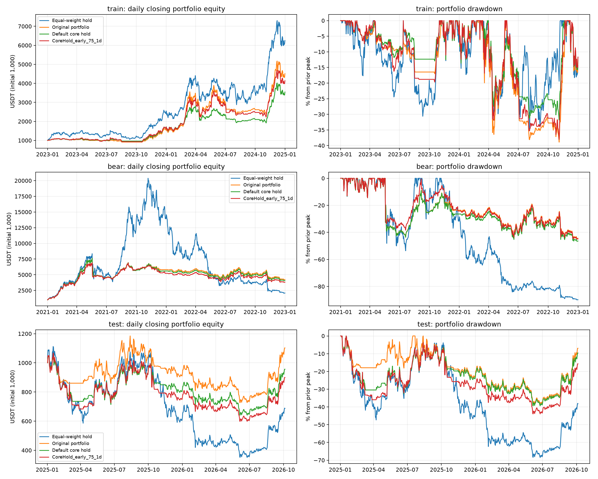

# CoreHold 回测结果（2026-10-06）

现货；当前配置的 11 币；初始资金 1,000 USDT；单边手续费 0.1%；可用资金比例 100%；日线成交模拟，周线仓位信号。未修改正在运行的交易配置。

## 参数选择与比较

训练收益最高组合：`CoreHold_early_75_1d`。
训练收益减两倍回撤评分最高组合：`CoreHold_early_75_1d`。
两种选择仅使用训练结果；后续仅对选中组合和两个原始对照运行验证。

收益为期末逐日收盘盯市权益相对初始资金的变化；回撤来自逐日总权益，包含持仓浮盈亏。清算收益额外扣除剩余持仓的卖出手续费。

| 区间 | 策略 | 盯市收益 | 清算收益 | 组合最大回撤 | 平均现金占比 |
|---|---|---:|---:|---:|---:|
| train | Equal-weight hold | +525.28% | +524.66% | 34.72% | 8.12% |
| train | Original portfolio | +351.44% | +351.02% | 38.92% | 48.67% |
| train | Default core hold | +254.65% | +254.35% | 31.83% | 49.91% |
| train | CoreHold_early_75_1d | +314.28% | +313.92% | 38.05% | 42.38% |
| bear | Equal-weight hold | +107.99% | +107.80% | 89.89% | 5.85% |
| bear | Original portfolio | +323.60% | +323.34% | 44.51% | 45.91% |
| bear | Default core hold | +307.57% | +307.32% | 46.57% | 45.29% |
| bear | CoreHold_early_75_1d | +281.10% | +280.86% | 44.98% | 46.94% |
| test | Equal-weight hold | -31.23% | -31.30% | 68.49% | 5.21% |
| test | Original portfolio | +10.23% | +10.15% | 38.63% | 48.64% |
| test | Default core hold | -4.37% | -4.44% | 39.39% | 47.21% |
| test | CoreHold_early_75_1d | -10.04% | -10.11% | 43.91% | 44.35% |

实际数据覆盖：

- train: 2023-01-01 00:00:00+00:00 至 2025-01-01 00:00:00+00:00
- bear: 2021-01-01 00:00:00+00:00 至 2023-01-01 00:00:00+00:00
- test: 2025-01-02 00:00:00+00:00 至 2026-10-05 00:00:00+00:00

## 结论

原 Portfolio 在三个区间的收益均高于默认 CoreHold 和训练选中的候选。提前入场、75% 核心、1 天确认在训练中改善默认收益，但在历史压力与留出区间收益均下降；训练及留出区间的组合回撤也高于默认 CoreHold。因此不将该候选设为默认，不改变运行中的交易配置。

CoreHold 的默认 50% 核心与 2 天退出确认保留，前一轮成交状态、最小交易金额和已收盘数据读取的代码修复保留。这是未能通过后续验证的参数试验，不是已证实的收益优化。

## 会计核对与基准约定

所有成交（包括部分卖出）的现金流重建终值，均与引擎 final_balance 核对，误差小于 0.05 USDT。该引擎终值包含期末强制平仓；主比较剔除期末强制平仓订单，并将剩余代币统一按最后日线收盘价计价。清算列对这些剩余代币扣一次卖出手续费。已实现收益只通过现金流进入权益一次。

等权基准为每币预留 1/11 初始现金，起点或该币已有 61 根完整日线后的第一个开盘买入；新上市币之前保留现金；以后不调仓。策略使用相同币池、资金、费用和日期，但资金可随策略规则在现有币间分配。

## 数据和解释范围

11 个币的日线和周线已下载；日线无重复、断档或非正收盘价格。逐币覆盖和检查结果见 data_manifest.json。

train 为参数选择区间。test 使用不与训练重叠的后续行情，但历史价格现在已知，这属于回顾性留出检验；bear 为先前已经参与策略开发的历史压力测试，不应称为完全未知样本。当前固定币池存在幸存者选择偏差。

回测以日线开盘模拟市场单，没有盘口、滑点或日内执行细节。一次留出检验不能证明实盘稳定有效。

## 产物

- summary.csv：全部训练组合和选中组合验证结果；包含牛市买入滞后诊断。
- results/*/equity_*.csv：逐日现金及组合权益。
- selection.json：冻结的训练参数选择。
- equity_comparison.png：权益与回撤对比图。
- README.md：下载、回测及分析复现命令。

