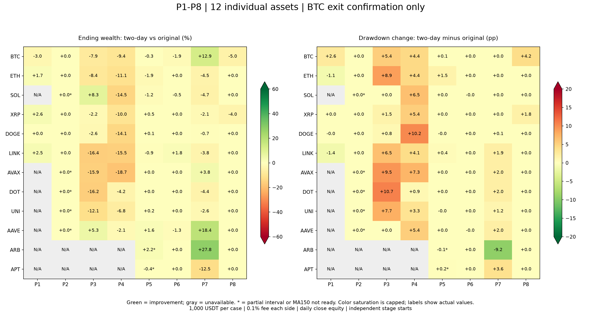
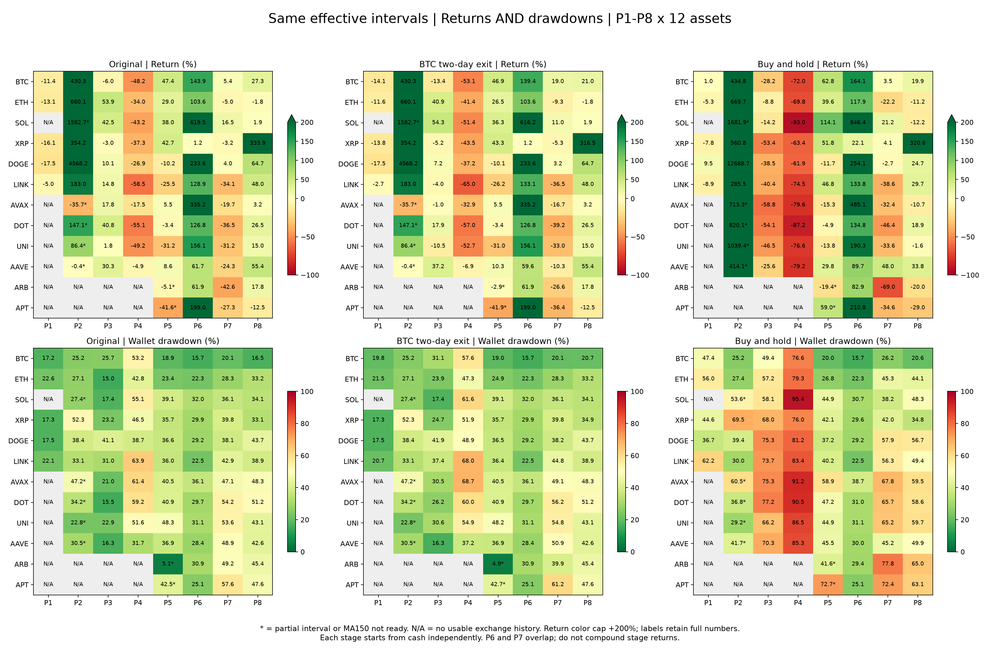

# P1–P8 × 12 标的：原版、BTC 两天退出与持有

用户指定的 96 个组合中，83 个可运行：77 个覆盖完整阶段、6 个为明确缩短的有效区间；13 个因本交易所尚无历史或暖机不足不可用。完成 166 次新原生策略回测及 83 条持有基准，共 249 条权益曲线。正式策略未修改。

## 比较口径

- 每个标的、每个阶段独立从 1000 USDT 现金开始，单币、单仓位，现货只做多。不同阶段的现金、仓位、风控峰值与冷却状态不继承；这是独立阶段测试，不能将 P1–P8 收益相加或复利成连续账户。P6 与 P7 在 2024 年 3 月重叠，不能当作独立统计样本。
- 原版为冻结的 cycle_risk_strategy.py。候选仅将 BTC 弱势退出从 1 根完成日线改为连续 2 根，个币两天退出、入场、14 天冷却及账户风控全部保留。
- 使用 Binance USDT 现货日线，按 UTC 日期包含起止日。每边手续费 0.1%，滑点为 0；相同区间相同价格。策略信号使用完成日线、下一交易日执行。
- 主表收益为期末现金与持仓按收盘价计价的权益收益；回撤为整个账户日线收盘权益（含现金）的历史峰值回撤，初始 1000 也计入峰值。主表三组均不额外强制卖出期末仓位，避免仅策略多算结束交易费用；summary.csv 另列 liquidated_return_pct，可比较统一假定清仓的收益。
- 持有在有效测试起点的开盘价一次买入，扣买入费，不择时、不风控；末日持仓仍按收盘价计价。回撤为日线收盘口径，不是日内最高价至最低价的跌幅。
- 6 个部分区间三组均从同一有效起点开始。另有 APT P5 区间完整但 MA150 尚未形成；这些共 7 个暖机案例单列，不纳入“完整且 MA150 已就绪”的 76 个核心比较。
- 不设置“回撤最多扩大 5 个百分点”等硬筛选，综合观察收益、回撤、熊市损失及跨标的一致性。未针对这些阶段搜索参数，也没有将既有研究后的复核称为样本外测试。

## 总体结果

- 全部83个可运行案例，两天退出相对原版：收益改善 16、下降 37、相同 30；回撤改善 9、扩大 35、相同 39；收益提高且回撤降低 7。收益变化中位数 +0.00 个百分点，回撤变化中位数 +0.00 个百分点。
- 76个完整且MA150就绪案例，两天退出相对原版：收益改善 15、下降 36、相同 25；回撤改善 8、扩大 34、相同 34；收益提高且回撤降低 6。收益变化中位数 +0.00 个百分点，回撤变化中位数 +0.00 个百分点。
- 原版相对持有：收益更高 46/83，回撤更低 77/83；二者同时改善 46/83。暖机阶段的参与时间不同，需结合下方完整表解释。
- 两天退出相对持有：收益更高 44/83，回撤更低 75/83；二者同时改善 43/83。暖机阶段的参与时间不同，需结合下方完整表解释。

|阶段|案例数|收益改善/下降/相同|回撤改善/扩大/相同|两项同时改善|收益变化中位数 pp|回撤变化中位数 pp|
|---|---:|---|---|---:|---:|---:|
|P1 极端暴跌与V型反转|5|4/1/0|3/1/1|3|+1.47|-0.01|
|P2 强势牛市|10|0/0/10|0/0/10|0|+0.00|+0.00|
|P3 暴跌与震荡|10|2/8/0|0/8/2|0|-9.89|+5.94|
|P4 长期熊市|10|0/10/0|0/10/0|0|-6.36|+4.90|
|P5 熊市修复与区间震荡|12|5/5/2|3/5/4|3|+0.00|+0.00|
|P6 趋势上涨|12|1/3/8|2/2/8|0|+0.00|+0.00|
|P7 高位宽幅震荡|12|4/8/0|1/7/4|1|-1.90|+0.64|
|P8 BTC强势阶段与资产分化|12|0/2/10|0/2/10|0|+0.00|+0.00|

各阶段按标的等权统计的中位数与次数用于描述一致性，不是实际多币组合收益；本轮是单币测试，账户风控和预算行为也不同于此前多币组合。

## 每个标的的稳定性

|标的|完整且MA150就绪案例|收益改善/下降/相同|回撤改善/扩大/相同|同时改善|
|---|---:|---|---|---:|
|BTC|8|1/6/1|0/6/2|0|
|ETH|8|1/4/3|1/3/4|1|
|SOL|6|1/4/1|1/1/4|0|
|XRP|8|2/4/2|0/4/4|0|
|DOGE|8|2/3/3|2/3/3|2|
|LINK|8|2/4/2|1/5/2|1|
|AVAX|6|1/2/3|0/3/3|0|
|DOT|6|0/3/3|0/3/3|0|
|UNI|6|1/3/2|1/3/2|1|
|AAVE|6|3/2/1|1/2/3|0|
|ARB|3|1/0/2|1/0/2|1|
|APT|3|0/1/2|0/1/2|0|

## 图表

## 96 个组合完整结果

**数值全部为百分比；每组均列收益 / 最大回撤。** 两天版收益变化与回撤变化单位为百分点。正回撤变化表示回撤扩大。`*` 为部分区间，`†` 为有效起点 MA150 未形成。

### P1 2020-03-01—2020-04-30：极端暴跌与V型反转

|标的|原版收益 / 回撤|两天退出收益 / 回撤|持有收益 / 回撤|收益变化 pp|回撤变化 pp|实际覆盖与说明|
|---|---:|---:|---:|---:|---:|---|
|BTC|-11.45% / 17.20%|-14.13% / 19.80%|+1.03% / 47.44%|-2.68|+2.60|完整|
|ETH|-13.11% / 22.64%|-11.64% / 21.50%|-5.25% / 55.97%|+1.47|-1.14|完整|
|SOL|不可用|不可用|不可用|—|—|本交易所尚无该标的历史|
|XRP|-16.06% / 17.26%|-13.84% / 17.26%|-7.79% / 44.65%|+2.22|+0.00|完整|
|DOGE|-17.48% / 17.48%|-17.47% / 17.47%|+9.48% / 36.69%|+0.01|-0.01|完整|
|LINK|-5.00% / 22.11%|-2.66% / 20.73%|-8.90% / 62.18%|+2.34|-1.38|完整|
|AVAX|不可用|不可用|不可用|—|—|本交易所尚无该标的历史|
|DOT|不可用|不可用|不可用|—|—|本交易所尚无该标的历史|
|UNI|不可用|不可用|不可用|—|—|本交易所尚无该标的历史|
|AAVE|不可用|不可用|不可用|—|—|本交易所尚无该标的历史|
|ARB|不可用|不可用|不可用|—|—|本交易所尚无该标的历史|
|APT|不可用|不可用|不可用|—|—|本交易所尚无该标的历史|
### P2 2020-10-01—2021-04-30：强势牛市

|标的|原版收益 / 回撤|两天退出收益 / 回撤|持有收益 / 回撤|收益变化 pp|回撤变化 pp|实际覆盖与说明|
|---|---:|---:|---:|---:|---:|---|
|BTC|+430.27% / 25.17%|+430.27% / 25.17%|+434.83% / 25.17%|+0.00|+0.00|完整|
|ETH|+660.10% / 27.10%|+660.10% / 27.10%|+669.71% / 27.41%|+0.00|+0.00|完整|
|SOL*†|+1582.71% / 27.36%|+1582.71% / 27.36%|+1681.86% / 53.63%|+0.00|+0.00|2020-10-11—2021-04-30；先等待MA150|
|XRP|+354.24% / 52.29%|+354.24% / 52.29%|+560.77% / 69.54%|+0.00|+0.00|完整|
|DOGE|+4568.18% / 38.44%|+4568.18% / 38.44%|+12688.70% / 39.45%|+0.00|+0.00|完整|
|LINK|+183.05% / 33.13%|+183.05% / 33.13%|+285.53% / 29.97%|+0.00|+0.00|完整|
|AVAX*†|-35.67% / 47.24%|-35.67% / 47.24%|+713.26% / 60.46%|+0.00|+0.00|2020-11-22—2021-04-30；先等待MA150|
|DOT*†|+147.06% / 34.16%|+147.06% / 34.16%|+820.14% / 36.76%|+0.00|+0.00|2020-10-18—2021-04-30；先等待MA150|
|UNI*†|+86.36% / 22.82%|+86.36% / 22.82%|+1039.41% / 29.20%|+0.00|+0.00|2020-11-17—2021-04-30；先等待MA150|
|AAVE*†|-0.38% / 30.46%|-0.38% / 30.46%|+414.11% / 41.70%|+0.00|+0.00|2020-12-15—2021-04-30；先等待MA150|
|ARB|不可用|不可用|不可用|—|—|本交易所尚无该标的历史|
|APT|不可用|不可用|不可用|—|—|本交易所尚无该标的历史|
### P3 2021-05-01—2021-07-31：暴跌与震荡

|标的|原版收益 / 回撤|两天退出收益 / 回撤|持有收益 / 回撤|收益变化 pp|回撤变化 pp|实际覆盖与说明|
|---|---:|---:|---:|---:|---:|---|
|BTC|-5.95% / 25.72%|-13.41% / 31.12%|-28.21% / 49.39%|-7.45|+5.40|完整|
|ETH|+53.85% / 14.96%|+40.85% / 23.86%|-8.80% / 57.20%|-13.00|+8.91|完整|
|SOL|+42.54% / 17.40%|+54.33% / 17.40%|-14.21% / 58.06%|+11.79|+0.00|完整|
|XRP|-3.03% / 23.20%|-5.16% / 24.66%|-53.39% / 68.00%|-2.13|+1.46|完整|
|DOGE|+10.10% / 41.11%|+7.19% / 41.90%|-38.53% / 75.29%|-2.92|+0.79|完整|
|LINK|+14.79% / 30.96%|-4.04% / 37.45%|-40.45% / 73.71%|-18.82|+6.49|完整|
|AVAX|+17.76% / 21.00%|-0.99% / 30.46%|-58.83% / 75.26%|-18.75|+9.46|完整|
|DOT|+40.76% / 15.53%|+17.90% / 26.24%|-54.08% / 77.16%|-22.86|+10.71|完整|
|UNI|+1.80% / 22.93%|-10.52% / 30.65%|-46.50% / 66.24%|-12.32|+7.72|完整|
|AAVE|+30.34% / 16.35%|+37.23% / 16.35%|-25.62% / 70.28%|+6.89|+0.00|完整|
|ARB|不可用|不可用|不可用|—|—|本交易所尚无该标的历史|
|APT|不可用|不可用|不可用|—|—|本交易所尚无该标的历史|
### P4 2021-11-01—2022-11-30：长期熊市

|标的|原版收益 / 回撤|两天退出收益 / 回撤|持有收益 / 回撤|收益变化 pp|回撤变化 pp|实际覆盖与说明|
|---|---:|---:|---:|---:|---:|---|
|BTC|-48.22% / 53.24%|-53.07% / 57.63%|-72.03% / 76.63%|-4.86|+4.39|完整|
|ETH|-34.00% / 42.82%|-41.35% / 47.26%|-69.84% / 79.30%|-7.35|+4.44|完整|
|SOL|-43.16% / 55.11%|-51.40% / 61.62%|-93.02% / 95.42%|-8.24|+6.51|完整|
|XRP|-37.25% / 46.50%|-43.54% / 51.86%|-63.39% / 76.00%|-6.29|+5.36|完整|
|DOGE|-26.93% / 38.70%|-37.20% / 48.94%|-61.91% / 81.23%|-10.27|+10.24|完整|
|LINK|-58.54% / 63.92%|-64.98% / 67.99%|-74.45% / 83.37%|-6.44|+4.07|完整|
|AVAX|-17.52% / 61.39%|-32.93% / 68.71%|-79.63% / 91.23%|-15.41|+7.32|完整|
|DOT|-55.14% / 59.19%|-57.02% / 60.05%|-87.25% / 90.47%|-1.88|+0.86|完整|
|UNI|-49.18% / 51.55%|-52.66% / 54.87%|-76.57% / 86.46%|-3.47|+3.31|完整|
|AAVE|-4.90% / 31.74%|-6.95% / 37.18%|-79.24% / 85.26%|-2.04|+5.44|完整|
|ARB|不可用|不可用|不可用|—|—|本交易所尚无该标的历史|
|APT|不可用|不可用|不可用|—|—|本阶段内不足60根完成日线，无法完成策略暖机|
### P5 2023-01-01—2023-09-30：熊市修复与区间震荡

|标的|原版收益 / 回撤|两天退出收益 / 回撤|持有收益 / 回撤|收益变化 pp|回撤变化 pp|实际覆盖与说明|
|---|---:|---:|---:|---:|---:|---|
|BTC|+47.36% / 18.88%|+46.86% / 18.95%|+62.83% / 20.00%|-0.51|+0.07|完整|
|ETH|+28.98% / 23.40%|+26.53% / 24.86%|+39.55% / 26.75%|-2.46|+1.46|完整|
|SOL|+37.97% / 39.06%|+36.27% / 39.06%|+114.13% / 44.86%|-1.70|+0.00|完整|
|XRP|+42.68% / 35.67%|+43.32% / 35.69%|+51.78% / 42.14%|+0.65|+0.01|完整|
|DOGE|-10.18% / 36.56%|-10.13% / 36.53%|-11.72% / 37.18%|+0.05|-0.03|完整|
|LINK|-25.53% / 36.02%|-26.20% / 36.43%|+46.78% / 40.16%|-0.68|+0.41|完整|
|AVAX|+5.50% / 40.45%|+5.50% / 40.45%|-15.31% / 58.90%|+0.00|+0.00|完整|
|DOT|-3.37% / 40.91%|-3.37% / 40.91%|-4.85% / 47.21%|+0.00|+0.00|完整|
|UNI|-31.16% / 48.28%|-31.00% / 48.24%|-13.85% / 44.92%|+0.16|-0.04|完整|
|AAVE|+8.62% / 36.90%|+10.32% / 36.90%|+29.79% / 45.54%|+1.71|+0.00|完整|
|ARB*†|-5.05% / 5.05%|-2.94% / 4.94%|-19.42% / 41.60%|+2.11|-0.11|2023-05-23—2023-09-30；先等待MA150|
|APT†|-41.64% / 42.46%|-41.85% / 42.67%|+58.97% / 72.73%|-0.21|+0.20|完整；先等待MA150|
### P6 2023-10-01—2024-03-31：趋势上涨

|标的|原版收益 / 回撤|两天退出收益 / 回撤|持有收益 / 回撤|收益变化 pp|回撤变化 pp|实际覆盖与说明|
|---|---:|---:|---:|---:|---:|---|
|BTC|+143.95% / 15.72%|+139.38% / 15.72%|+164.10% / 15.72%|-4.57|+0.00|完整|
|ETH|+103.56% / 22.29%|+103.56% / 22.29%|+117.95% / 22.29%|+0.00|+0.00|完整|
|SOL|+619.51% / 32.04%|+616.24% / 32.04%|+846.41% / 30.66%|-3.27|-0.00|完整|
|XRP|+1.22% / 29.87%|+1.22% / 29.87%|+22.10% / 29.60%|+0.00|+0.00|完整|
|DOGE|+233.59% / 29.23%|+233.59% / 29.23%|+254.08% / 29.23%|+0.00|+0.00|完整|
|LINK|+128.95% / 22.49%|+133.08% / 22.49%|+133.84% / 22.49%|+4.14|+0.00|完整|
|AVAX|+335.24% / 36.09%|+335.24% / 36.09%|+485.11% / 38.71%|+0.00|+0.00|完整|
|DOT|+126.78% / 29.74%|+126.78% / 29.74%|+134.83% / 31.01%|+0.00|+0.00|完整|
|UNI|+156.08% / 31.10%|+156.08% / 31.10%|+190.26% / 31.10%|+0.00|+0.00|完整|
|AAVE|+61.67% / 28.39%|+59.61% / 28.39%|+89.73% / 29.98%|-2.07|-0.00|完整|
|ARB|+61.86% / 30.85%|+61.86% / 30.85%|+82.89% / 29.38%|+0.00|+0.00|完整|
|APT|+199.04% / 25.07%|+199.04% / 25.07%|+210.85% / 25.07%|+0.00|+0.00|完整|
### P7 2024-03-01—2024-09-30：高位宽幅震荡

|标的|原版收益 / 回撤|两天退出收益 / 回撤|持有收益 / 回撤|收益变化 pp|回撤变化 pp|实际覆盖与说明|
|---|---:|---:|---:|---:|---:|---|
|BTC|+5.42% / 20.12%|+19.01% / 20.12%|+3.49% / 26.15%|+13.59|+0.00|完整|
|ETH|-5.02% / 28.35%|-9.31% / 28.35%|-22.17% / 45.26%|-4.29|+0.00|完整|
|SOL|+16.46% / 36.14%|+11.00% / 36.14%|+21.21% / 38.23%|-5.46|+0.00|完整|
|XRP|-3.24% / 39.84%|-5.27% / 39.84%|+4.09% / 41.98%|-2.03|+0.00|完整|
|DOGE|+3.97% / 38.12%|+3.24% / 38.20%|-2.75% / 57.94%|-0.73|+0.09|完整|
|LINK|-34.05% / 42.89%|-36.54% / 44.81%|-38.58% / 56.27%|-2.49|+1.92|完整|
|AVAX|-19.74% / 47.13%|-16.71% / 49.14%|-32.45% / 67.78%|+3.03|+2.01|完整|
|DOT|-36.47% / 54.21%|-39.25% / 56.21%|-46.42% / 65.75%|-2.78|+2.00|完整|
|UNI|-31.21% / 53.59%|-32.97% / 54.78%|-33.63% / 65.16%|-1.77|+1.19|完整|
|AAVE|-24.26% / 48.89%|-10.30% / 50.85%|+48.00% / 45.20%|+13.96|+1.96|完整|
|ARB|-42.60% / 49.16%|-26.64% / 39.93%|-68.96% / 77.79%|+15.96|-9.23|完整|
|APT|-27.28% / 57.56%|-36.36% / 61.17%|-34.57% / 72.44%|-9.08|+3.60|完整|
### P8 2024-11-01—2025-02-28：BTC强势阶段与资产分化

|标的|原版收益 / 回撤|两天退出收益 / 回撤|持有收益 / 回撤|收益变化 pp|回撤变化 pp|实际覆盖与说明|
|---|---:|---:|---:|---:|---:|---|
|BTC|+27.34% / 16.53%|+20.98% / 20.70%|+19.88% / 20.63%|-6.36|+4.17|完整|
|ETH|-1.80% / 33.18%|-1.80% / 33.18%|-11.25% / 44.12%|+0.00|+0.00|完整|
|SOL|+1.89% / 34.05%|+1.89% / 34.05%|-12.25% / 48.35%|+0.00|+0.00|完整|
|XRP|+333.91% / 33.08%|+316.47% / 34.91%|+320.56% / 34.84%|-17.45|+1.83|完整|
|DOGE|+64.70% / 43.73%|+64.70% / 43.73%|+24.75% / 56.72%|+0.00|+0.00|完整|
|LINK|+47.98% / 38.92%|+47.98% / 38.92%|+29.67% / 49.38%|+0.00|+0.00|完整|
|AVAX|+3.16% / 48.32%|+3.16% / 48.32%|-10.72% / 59.48%|+0.00|+0.00|完整|
|DOT|+26.48% / 51.23%|+26.48% / 51.23%|+18.90% / 58.62%|+0.00|+0.00|完整|
|UNI|+14.96% / 43.05%|+14.96% / 43.05%|-1.64% / 59.70%|+0.00|+0.00|完整|
|AAVE|+55.42% / 42.64%|+55.42% / 42.64%|+33.83% / 49.87%|+0.00|+0.00|完整|
|ARB|+17.75% / 45.37%|+17.75% / 45.37%|-20.00% / 64.97%|+0.00|+0.00|完整|
|APT|-12.48% / 47.64%|-12.48% / 47.64%|-29.00% / 63.12%|+0.00|+0.00|完整|

## 差异最大的案例

收益差按“候选期末权益 / 原版期末权益 − 1”排序，避免极高牛市收益下百分点差异误导。以下只看完整且 MA150 已就绪案例。

|方向|标的阶段|两天/原版期末权益变化|收益变化 pp|回撤变化 pp|
|---|---|---:|---:|---:|
|改善|ARB P7|+27.81%|+15.96|-9.23|
|改善|AAVE P7|+18.43%|+13.96|+1.96|
|改善|BTC P7|+12.90%|+13.59|+0.00|
|改善|SOL P3|+8.27%|+11.79|+0.00|
|改善|AAVE P3|+5.29%|+6.89|+0.00|
|改善|AVAX P7|+3.78%|+3.03|+2.01|
|下降|AVAX P4|-18.69%|-15.41|+7.32|
|下降|LINK P3|-16.40%|-18.82|+6.49|
|下降|DOT P3|-16.24%|-22.86|+10.71|
|下降|AVAX P3|-15.92%|-18.75|+9.46|
|下降|LINK P4|-15.53%|-6.44|+4.07|
|下降|SOL P4|-14.50%|-8.24|+6.51|

## 交易与现金参与

十天内亏损平仓数只是短期亏损交易的描述，不等同于所有假突破；未结束的期末交易不计入此数。换手次数包含风险减仓/恢复的实际成交，主表权益已计入手续费。

|阶段|原版实际成交数|两天版实际成交数|原版十天内亏损笔数|两天版十天内亏损笔数|原版平均现金占比中位数|两天版平均现金占比中位数|
|---|---:|---:|---:|---:|---:|---:|
|P1|30|30|13|13|78.69%|75.41%|
|P2|89|89|5|5|37.50%|37.50%|
|P3|74|76|15|15|69.57%|68.11%|
|P4|345|337|123|112|79.95%|78.71%|
|P5|249|251|63|63|47.97%|47.78%|
|P6|98|98|24|24|10.05%|9.77%|
|P7|235|230|58|56|57.54%|53.70%|
|P8|103|103|19|19|26.45%|26.45%|

## 如何理解这些阶段

1. **P1：保护回撤与捕捉 V 型反弹是两件事。** BTC：原版 -11.45% / 17.20%，两天版 -14.13% / 19.80%，持有 +1.03% / 47.44%。较低阶段回撤并不保证期末收益胜过持有。原策略使用日线确认，stoploss=-0.99；本次没有加入新的紧止损，日线收盘回撤也不能代表盘中黑天鹅损失。
2. **P2：强牛市中两天确认没有额外贡献。** 10 个可测标的两版相同。延迟 BTC 退出不会改变入场、个币退出、14 日冷却或 MA150 等待，因此不能解决这些条件造成的上涨参与不足。DOGE：原版 +4568.18% / 38.44%，两天版 +4568.18% / 38.44%，持有 +12688.70% / 39.45%。上市初期五币另需考虑 MA150 等待，不能直接用其持有差距评价退出改动。
3. **P3：暴跌震荡时，额外一天不必然减少假突破损失。** 收益改善 2、下降 8。LINK：原版 +14.79% / 30.96%，两天版 -4.04% / 37.45%，持有 -40.45% / 73.71%。SOL、AAVE 的改善也如实保留在完整表中，不能概括所有币都退步。
4. **P4：熊市代价最一致。** 收益下降 10/10，回撤扩大 10/10。SOL：原版 -43.16% / 55.11%，两天版 -51.40% / 61.62%，持有 -93.02% / 95.42%。虽然两版均能明显缓解持有的长期下跌损失，两天版在这个阶段没有优势。
5. **P5：修复行情需要分别看币，不能用一项总收益概括。** 两天版收益改善/下降/相同为 5/5/2。ARB 从 2023-05-23 起测且尚待 MA150，APT 也有 MA150 等待，两者不纳入成熟完整样本。
6. **P6：趋势上涨主要由原有入场和个币持仓规则决定。** 两天版收益改善/下降/相同为 1/3/8。SOL：原版 +619.51% / 32.04%，两天版 +616.24% / 32.04%，持有 +846.41% / 30.66%。若两版相同而明显落后持有，差距就不是本轮改动能解决的问题。
7. **P7：高位震荡要核对收益与回撤是否同步改善。** 收益改善 4/12，回撤改善 1/12，两项同时改善 1/12；所有退步币均列在上表。
8. **P8：资产分化保留单币结果。** XRP：原版 +333.91% / 33.08%，两天版 +316.47% / 34.91%，持有 +320.56% / 34.84%。ETH：原版 -1.80% / 33.18%，两天版 -1.80% / 33.18%，持有 -11.25% / 44.12%。两版仍保留相同 BTC 入场过滤，退出延迟不等于新增独立行情通道；只看 BTC 或平均值会掩盖不同标的表现。

这些日期是用户指定的历史测试框架，阶段标签用于分组，不表示区间内每天处于同一种行情。单币表现也不能直接替代同时持有十二币的组合回测，尤其原版账户回撤风控存在跨持仓影响。ARB/APT 的供应压力、XRP 的事件驱动等已体现在历史价格中，但本次没有单独建立解锁或新闻事件模型。

## 综合取舍口径

按用户最新要求，不因为某些阶段收益稍低或回撤扩大就淘汰候选。重点综合：关键时刻保留的趋势收益、是否避免反复退出或严重账户损失、最差阶段结果，以及跨标的一致性。以下额外列出收益差异最大的实际案例与尾部损失分布，不设置固定回撤门槛。此前多币长周期的改善仍是已有证据，但与本轮“单币、阶段起点现金重置”的条件不同，不能互相替代。正式策略未切换属于本轮测试范围，不等于预先否定两天版。

## 关键改善与尾部损失

以下仅看 76 个完整且 MA150 已就绪案例。它们并非独立同分布样本，次数是历史描述，不是概率估计；没有用这些幅度作为淘汰门槛。关注“少数关键改善能否抵偿普遍或极端损失”，而非只按胜率投票。

|方法|最差阶段收益（标的/阶段）|最高账户回撤（标的/阶段）|阶段亏损至少50%的案例|阶段亏损至少70%的案例|回撤至少60%的案例|
|---|---|---|---:|---:|---:|
|原版|-58.54%（LINK P4）|63.92%（LINK P4）|2|0|2|
|两天退出|-64.98%（LINK P4）|68.71%（AVAX P4）|5|0|5|
|持有|-93.02%（SOL P4）|95.42%（SOL P4）|14|7|26|

**两天版改善最大的六个实际案例**（按相对期末权益排序）：

|标的阶段|原版收益 / 回撤|两天版收益 / 回撤|持有收益 / 回撤|相对原版期末权益变化|
|---|---:|---:|---:|---:|
|ARB P7|-42.60% / 49.16%|-26.64% / 39.93%|-68.96% / 77.79%|+27.81%|
|AAVE P7|-24.26% / 48.89%|-10.30% / 50.85%|+48.00% / 45.20%|+18.43%|
|BTC P7|+5.42% / 20.12%|+19.01% / 20.12%|+3.49% / 26.15%|+12.90%|
|SOL P3|+42.54% / 17.40%|+54.33% / 17.40%|-14.21% / 58.06%|+8.27%|
|AAVE P3|+30.34% / 16.35%|+37.23% / 16.35%|-25.62% / 70.28%|+5.29%|
|AVAX P7|-19.74% / 47.13%|-16.71% / 49.14%|-32.45% / 67.78%|+3.78%|

**一个实际保住行情的事件：AAVE P7，2024-08-18 入场。** 原版在 08-19 因 BTC 一天弱势退出，该笔净收益约 +1.49 USDT；两天版未在这一天退出，持有至 08-29，该笔净收益约 +97.95 USDT。两笔成交资金会受此前账户路径影响，不能把差额全部当作独立的单次退出效果；但退出时点与持仓延续确实不同。这是两天确认的具体价值，不只是“某个阶段多赚了一点”。同一阶段整体回撤仍略扩大，完整账户收益/回撤已列在上表。

**此前连续组合结果仍需一起考虑，不能因本轮熊市退步就抹去：**

|连续组合区间|原版收益 / 回撤|两天版收益 / 回撤|持有收益 / 回撤|
|---|---:|---:|---:|
|BTC/SOL/ETH 2021-01-01—2026-10-06|+10639.45% / 66.62%|+18736.96% / 63.67%|+2784.61% / 95.21%|
|BTC/SOL/ETH 2023-01-01—2026-10-06|+417.12% / 49.71%|+599.39% / 40.51%|+550.49% / 68.57%|
|BTC/SOL/ETH 2025-09-01—2026-10-06|-18.85% / 43.68%|+1.74% / 31.50%|-33.19% / 63.57%|

这些连续组合包含持仓复利和跨币账户风控，不能与单币阶段独立开户作同等案例计数。原有优势可支持保留候选，阶段损失则说明它不是没有代价；本轮不自动切换正式策略。完整历史组合结果见 [此前两天退出报告](../btc_exit_confirmation_20261008/REPORT.md)。

## 综合判断

两天版已有保住部分行情的实际价值，应保留为候选，不能单凭 P4 或阶段胜率淘汰。它的收益侧重减少过早退出；这组阶段并未显示它比原版更能缓解极端账户损失，尾部损失仍需承担。与持有相比，主要下跌保护在两版共有的 BTC/个币过滤和账户风控中已存在。

此前 BTC/SOL/ETH 连续账户在长期、2023 至今和近期均有明显改善，说明少数时段收益及后续复利可以改变最终结果；本轮扩大到十二币后，阶段优势集中于少数标的，不能直接推出十二币统一改为两天退出就会更好。八个阶段不覆盖完整历史、各阶段重置账户，和连续回测回答的是不同问题。综合证据支持保留两天版研究价值，正式策略的取舍应以确定的实际币池连续账户结果为依据。本轮未切换正式版。

## 验证与文件

- 36 项规则及截断历史检查通过：两版除 BTC 退出条件外一致，指标只依赖当时及以前数据。
- 重建 249 条持仓权益曲线，核对 747 项汇总指标、463 次实际 BTC 退出、466 次弱 BTC 入场冷却、32698 个日线风控权益记录。最大权益重建误差 1.455191523e-11 USDT，最大原生现金误差 1.499927293e-08 USDT。
- 冻结行情、研究策略及正式策略哈希全部一致；数据连续性、实际起止日期及每次独立开户已检查。
- [96组合CSV](comparison_matrix.csv)、[原始249行指标](summary.csv)、[覆盖清单](coverage.csv)、[汇总统计](aggregate.json)、[规则检查](verification.json)、[成交与权益核验](audit_verification.json)。
- 单笔成交与每日曲线保存在 results/；源数据 SHA256 保存在 data_audit.json；新增 DOT、ARB、APT 的 Binance 请求记录在 download_sources.json。
