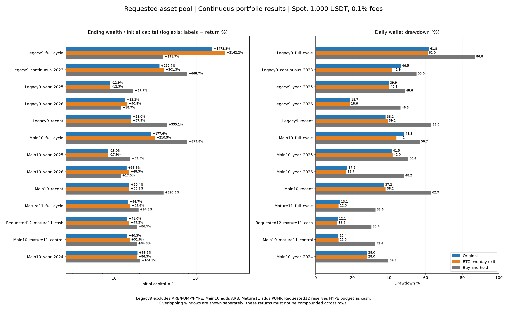
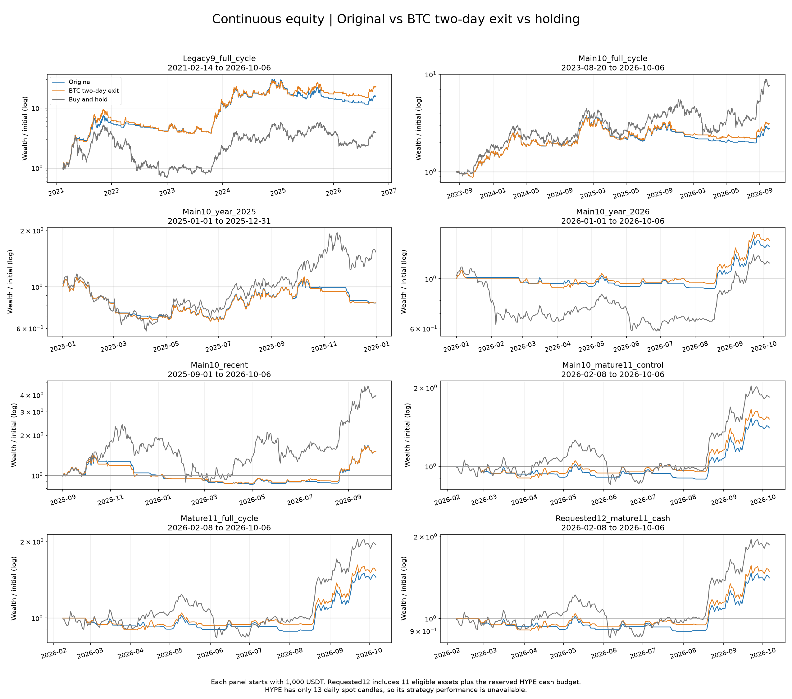

# 指定十二标的：原版、BTC 两天退出与持有

币池：BTC、ETH、BNB、LINK、XRP、UNI、ZEC、DOGE、SOL、ARB、PUMP、HYPE。用户确认沿用现货口径，因此永续代码统一对应 Binance USDT 现货；本轮没有杠杆、资金费率或做空。

完成 210 次新原生策略回测和 105 条持有基准，共 315 条权益曲线。正式策略和运行服务未修改。研究重点是这组实际币池的连续组合，不以单币阶段胜率决定正式升级。

## 数据与比较口径

- 资金 1000 USDT，每边手续费 0.1%，滑点 0，日线、只做多；冻结完整历史至 2026-10-06。两版除 BTC 弱势退出从一天改为连续两天外，入场、个币两天退出、14日冷却、各币独立预算复利和账户风控均相同。
- 收益按期末现金与持仓的收盘价权益计算；最大回撤是包含现金的日线收盘账户峰值回撤。三组均不额外强制卖出末日仓位；summary.csv 另列统一假定清仓收益 liquidated_return_pct。
- 持有按各币等预算，在窗口开始的开盘价买入、扣买入费；历史尚未完成60日暖机的币，按与此前研究相同口径，预算先留现金、完成暖机后买入。持有不等待 MA150、不择时、不减仓；这会使上市初期参与时间与策略不同，相关案例单列。
- 每个窗口独立开户，窗口内持仓、复利和风险峰值连续继承；不同窗口不继承。P6与P7重叠，窗口次数不是独立样本概率，阶段收益不能相加或连乘。
- 历史可交易池只包含阶段内有足够暖机历史的币，资金按当期可测币数划分；固定十二槽位版本始终每币预留1/12预算，尚未上市或不能暖机的预算留现金。两类账户分别报告，现金预留导致的风险差异不归因于新币收益。
- 连续组合均尽量从该固定币池所有成员已形成 MA150 后开始，以减少上市初期等待的干扰。PUMP 另列60日暖机后和MA150就绪后两个单币窗口。HYPE仅13根日线，无法进行策略暖机；十二槽位近期账户实质为十一币加8.33%初始现金预算，不能当成已验证完整十二币。
- 按用户要求综合关键行情收益、最终复利、最差阶段损失和回撤，不设置固定回撤门槛，也不按阶段胜率直接淘汰候选。这是事后指定币池的历史研究，未称为样本外验证。

## 历史覆盖

|标的|Binance现货首日|日线数|60日暖机后可执行起点|MA150就绪后可执行起点|
|---|---|---:|---|---|
|BTC|2017-08-17|3338|2017-10-17|2018-01-14|
|ETH|2017-08-17|3338|2017-10-17|2018-01-14|
|BNB|2017-11-06|3257|2018-01-06|2018-04-05|
|LINK|2019-01-16|2821|2019-03-18|2019-06-15|
|XRP|2018-05-04|3078|2018-07-04|2018-10-01|
|UNI|2020-09-17|2211|2020-11-17|2021-02-14|
|ZEC|2019-03-21|2757|2019-05-21|2019-08-18|
|DOGE|2019-07-05|2651|2019-09-04|2019-12-02|
|SOL|2020-08-11|2248|2020-10-11|2021-01-08|
|ARB|2023-03-23|1294|2023-05-23|2023-08-20|
|PUMP|2025-09-11|391|2025-11-11|2026-02-08|
|HYPE|2026-09-24|13|尚未完成|尚未完成|

P1–P8 共96个单币请求：74个可测，22个不可用，3个部分区间。PUMP、HYPE都没有P1–P8的现货历史。

## 连续组合：正式升级的主要依据

**下表每组均为收益 / 最大回撤，单位 %；变化列单位为百分点。** `Legacy9` 为前九币（不含 ARB/PUMP/HYPE），`Main10` 加 ARB，`Mature11` 再加 PUMP。十二槽位版额外保留 HYPE 的1/12初始预算为现金。

|窗口与实际币数 / 槽位|日期|原版收益 / 回撤|两天退出收益 / 回撤|持有收益 / 回撤|收益变化 pp|回撤变化 pp|
|---|---|---:|---:|---:|---:|---:|
|Legacy9_full_cycle（9/9）|2021-02-14—2026-10-06|+1473.31% / 61.77%|+2162.18% / 61.04%|+291.73% / 86.83%|+688.87|-0.72|
|Legacy9_continuous_2023（9/9）|2023-01-01—2026-10-06|+252.67% / 46.45%|+301.26% / 41.91%|+668.68% / 55.02%|+48.58|-4.54|
|Legacy9_year_2025（9/9）|2025-01-01—2025-12-31|-12.88% / 39.89%|-12.32% / 40.15%|+67.71% / 48.61%|+0.56|+0.26|
|Legacy9_year_2026（9/9）|2026-01-01—2026-10-06|+33.18% / 18.74%|+40.83% / 18.59%|+18.70% / 46.32%|+7.65|-0.16|
|Legacy9_recent（9/9）|2025-09-01—2026-10-06|+58.03% / 38.17%|+57.91% / 39.24%|+335.08% / 63.03%|-0.12|+1.06|
|Main10_full_cycle（10/10）|2023-08-20—2026-10-06|+177.63% / 48.26%|+210.52% / 44.13%|+673.78% / 56.75%|+32.90|-4.13|
|Main10_year_2025（10/10）|2025-01-01—2025-12-31|-18.01% / 41.51%|-17.86% / 41.96%|+53.52% / 50.44%|+0.16|+0.45|
|Main10_year_2026（10/10）|2026-01-01—2026-10-06|+38.76% / 17.24%|+48.27% / 16.70%|+17.50% / 48.19%|+9.51|-0.54|
|Main10_recent（10/10）|2025-09-01—2026-10-06|+50.45% / 37.22%|+50.31% / 38.18%|+295.59% / 62.87%|-0.14|+0.95|
|Mature11_full_cycle（11/11）|2026-02-08—2026-10-06|+44.75% / 13.15%|+53.62% / 12.54%|+94.34% / 32.63%|+8.88|-0.61|
|Requested12_mature11_cash（11/12）|2026-02-08—2026-10-06|+40.99% / 12.07%|+49.15% / 11.76%|+86.48% / 30.41%|+8.16|-0.31|
|Main10_mature11_control（10/10）|2026-02-08—2026-10-06|+40.32% / 12.42%|+51.64% / 12.46%|+84.31% / 32.44%|+11.32|+0.04|
|Main10_year_2024（10/10）|2024-01-01—2024-12-31|+89.14% / 27.98%|+86.32% / 27.98%|+104.07% / 39.69%|-2.82|+0.00|

## 加入 PUMP 与 HYPE 现金预留的同日期控制

以下起止日期相同，区别仅为币池与预算槽位。加入PUMP会改变其他币预算及组合风险路径，因此差异是整体配置效果，不等于PUMP单币收益的直接贡献。逐币盈亏见 profit_attribution.csv。

|窗口与实际币数 / 槽位|日期|原版收益 / 回撤|两天退出收益 / 回撤|持有收益 / 回撤|收益变化 pp|回撤变化 pp|
|---|---|---:|---:|---:|---:|---:|
|Main10_mature11_control（10/10）|2026-02-08—2026-10-06|+40.32% / 12.42%|+51.64% / 12.46%|+84.31% / 32.44%|+11.32|+0.04|
|Mature11_full_cycle（11/11）|2026-02-08—2026-10-06|+44.75% / 13.15%|+53.62% / 12.54%|+94.34% / 32.63%|+8.88|-0.61|
|Requested12_mature11_cash（11/12）|2026-02-08—2026-10-06|+40.99% / 12.07%|+49.15% / 11.76%|+86.48% / 30.41%|+8.16|-0.31|

### PUMP 单币

|窗口与实际币数 / 槽位|日期|原版收益 / 回撤|两天退出收益 / 回撤|持有收益 / 回撤|收益变化 pp|回撤变化 pp|
|---|---|---:|---:|---:|---:|---:|
|PUMP_after_ma150（1/1）|2026-02-08—2026-10-06|+65.38% / 34.77%|+46.22% / 34.77%|+194.60% / 48.57%|-19.16|-0.00|
|PUMP_after_warmup（1/1）|2025-11-11—2026-10-06|+65.38% / 34.77%|+46.22% / 34.77%|+37.07% / 73.38%|-19.16|-0.00|

### HYPE：目前只能描述持有，不能评估策略

本交易所现货仅有 2026-09-24—2026-10-06 的 13 根日线。上市首日开盘买入、扣0.1%买入费后的持有收益 -0.14%，日线收盘回撤 7.01%。原版和两天版均不满足暖机/MA150，不能把等待期零交易当作策略优势；不参与两版胜率或升级判断。

## P1–P8 组合

同一阶段分别给出历史可交易池（资金投入当期可测币）和固定十二槽位账户（缺历史的预算留现金）。持有也使用相同预算与买入资格。

### 历史可交易池

|窗口与实际币数 / 槽位|日期|原版收益 / 回撤|两天退出收益 / 回撤|持有收益 / 回撤|收益变化 pp|回撤变化 pp|
|---|---|---:|---:|---:|---:|---:|
|EligiblePool_P1（7/7）|2020-03-01—2020-04-30|-12.39% / 19.39%|-12.56% / 19.74%|-4.58% / 50.08%|-0.16|+0.35|
|EligiblePool_P2（9/9）|2020-10-01—2021-04-30|+1659.37% / 24.10%|+1659.37% / 24.10%|+2185.38% / 26.25%|+0.00|+0.00|
|EligiblePool_P3（9/9）|2021-05-01—2021-07-31|+14.91% / 18.47%|+7.37% / 24.46%|-36.83% / 63.16%|-7.55|+6.00|
|EligiblePool_P4（9/9）|2021-11-01—2022-11-30|-34.94% / 41.13%|-47.65% / 52.63%|-69.78% / 77.77%|-12.71|+11.50|
|EligiblePool_P5（10/10）|2023-01-01—2023-09-30|+2.99% / 19.73%|+2.36% / 20.52%|+22.92% / 28.92%|-0.62|+0.79|
|EligiblePool_P6（10/10）|2023-10-01—2024-03-31|+171.90% / 15.77%|+171.46% / 15.80%|+200.71% / 15.33%|-0.44|+0.02|
|EligiblePool_P7（10/10）|2024-03-01—2024-09-30|-7.45% / 27.98%|-6.61% / 27.98%|-9.60% / 38.76%|+0.84|+0.00|
|EligiblePool_P8（10/10）|2024-11-01—2025-02-28|+52.89% / 30.07%|+50.61% / 30.91%|+35.37% / 40.19%|-2.28|+0.84|

### 固定十二槽位，缺历史预算留现金

|窗口与实际币数 / 槽位|日期|原版收益 / 回撤|两天退出收益 / 回撤|持有收益 / 回撤|收益变化 pp|回撤变化 pp|
|---|---|---:|---:|---:|---:|---:|
|RequestedSlots12_P1（7/12）|2020-03-01—2020-04-30|-7.23% / 11.70%|-7.32% / 11.91%|-2.67% / 30.41%|-0.09|+0.21|
|RequestedSlots12_P2（9/12）|2020-10-01—2021-04-30|+1244.48% / 23.67%|+1244.48% / 23.67%|+1639.03% / 25.89%|+0.00|+0.00|
|RequestedSlots12_P3（9/12）|2021-05-01—2021-07-31|+11.18% / 14.29%|+5.53% / 18.92%|-27.63% / 49.58%|-5.65|+4.63|
|RequestedSlots12_P4（9/12）|2021-11-01—2022-11-30|-30.06% / 35.16%|-33.34% / 38.20%|-52.34% / 59.91%|-3.28|+3.04|
|RequestedSlots12_P5（10/12）|2023-01-01—2023-09-30|+2.50% / 17.06%|+1.98% / 17.74%|+19.10% / 25.57%|-0.52|+0.68|
|RequestedSlots12_P6（10/12）|2023-10-01—2024-03-31|+143.21% / 14.67%|+142.86% / 14.69%|+167.26% / 14.36%|-0.35|+0.02|
|RequestedSlots12_P7（10/12）|2024-03-01—2024-09-30|-4.78% / 24.75%|-4.02% / 24.75%|-8.00% / 33.44%|+0.76|+0.00|
|RequestedSlots12_P8（10/12）|2024-11-01—2025-02-28|+43.11% / 28.04%|+41.20% / 28.81%|+29.48% / 36.92%|-1.90|+0.77|

## 分组统计

|窗口类型|案例数|两天版收益改善/下降/相同|回撤改善/扩大/相同|收益和回撤同时改善|原版收益胜持有|两天版收益胜持有|
|---|---:|---|---|---:|---:|---:|
|single|74|14/36/24|10/33/31|9|39|38|
|phase_pool|8|1/6/1|0/6/2|0|4|4|
|phase_pool_reserved|8|1/6/1|0/6/2|0|4|4|
|continuous_pool|11|8/3/0|6/4/1|6|3|3|
|continuous_pool_reserved|1|1/0/0|1/0/0|1|0|0|
|continuous_pool_control|1|1/0/0|0/1/0|0|0|0|
|new_asset|1|0/1/0|1/0/0|0|0|0|
|new_asset_immature|1|0/1/0|1/0/0|0|1|1|

这些是描述性次数，窗口有重叠，不能当作独立验证票数；同日期控制窗口也不与其他连续窗口重复累计成实际账户。

## 图表

## 十二币 P1–P8 完整单币结果

每组三列均为收益 / 最大回撤；`*` 为部分区间，`†` 为有效起点MA150未形成。

### P1 2020-03-01—2020-04-30：极端暴跌与V型反转

|标的|原版收益 / 回撤|两天版收益 / 回撤|持有收益 / 回撤|实际覆盖 / 原因|
|---|---:|---:|---:|---|
|BTC|-11.45% / 17.20%|-14.13% / 19.80%|+1.03% / 47.44%|完整|
|ETH|-13.11% / 22.64%|-11.64% / 21.50%|-5.25% / 55.97%|完整|
|BNB|-14.46% / 24.09%|-16.36% / 26.24%|-12.01% / 56.62%|完整|
|LINK|-5.00% / 22.11%|-2.66% / 20.73%|-8.90% / 62.18%|完整|
|XRP|-16.06% / 17.26%|-13.84% / 17.26%|-7.79% / 44.65%|完整|
|UNI|不可用|不可用|不可用|该阶段尚无 Binance 现货历史|
|ZEC|-9.21% / 22.48%|-15.66% / 25.19%|-8.63% / 53.70%|完整|
|DOGE|-17.48% / 17.48%|-17.47% / 17.47%|+9.48% / 36.69%|完整|
|SOL|不可用|不可用|不可用|该阶段尚无 Binance 现货历史|
|ARB|不可用|不可用|不可用|该阶段尚无 Binance 现货历史|
|PUMP|不可用|不可用|不可用|该阶段尚无 Binance 现货历史|
|HYPE|不可用|不可用|不可用|该阶段尚无 Binance 现货历史|
### P2 2020-10-01—2021-04-30：强势牛市

|标的|原版收益 / 回撤|两天版收益 / 回撤|持有收益 / 回撤|实际覆盖 / 原因|
|---|---:|---:|---:|---|
|BTC|+430.27% / 25.17%|+430.27% / 25.17%|+434.83% / 25.17%|完整|
|ETH|+660.10% / 27.10%|+660.10% / 27.10%|+669.71% / 27.41%|完整|
|BNB|+1920.69% / 35.32%|+1920.69% / 35.32%|+2025.17% / 36.89%|完整|
|LINK|+183.05% / 33.13%|+183.05% / 33.13%|+285.53% / 29.97%|完整|
|XRP|+354.24% / 52.29%|+354.24% / 52.29%|+560.77% / 69.54%|完整|
|UNI*†|+86.36% / 22.82%|+86.36% / 22.82%|+1039.41% / 29.20%|2020-11-17—2021-04-30；等待MA150|
|ZEC|+115.35% / 36.05%|+115.35% / 36.05%|+282.41% / 38.23%|完整|
|DOGE|+4568.18% / 38.44%|+4568.18% / 38.44%|+12688.70% / 39.45%|完整|
|SOL*†|+1582.71% / 27.36%|+1582.71% / 27.36%|+1681.86% / 53.63%|2020-10-11—2021-04-30；等待MA150|
|ARB|不可用|不可用|不可用|该阶段尚无 Binance 现货历史|
|PUMP|不可用|不可用|不可用|该阶段尚无 Binance 现货历史|
|HYPE|不可用|不可用|不可用|该阶段尚无 Binance 现货历史|
### P3 2021-05-01—2021-07-31：暴跌与震荡

|标的|原版收益 / 回撤|两天版收益 / 回撤|持有收益 / 回撤|实际覆盖 / 原因|
|---|---:|---:|---:|---|
|BTC|-5.95% / 25.72%|-13.41% / 31.12%|-28.21% / 49.39%|完整|
|ETH|+53.85% / 14.96%|+40.85% / 23.86%|-8.80% / 57.20%|完整|
|BNB|-6.59% / 22.72%|-16.55% / 29.21%|-46.67% / 61.44%|完整|
|LINK|+14.79% / 30.96%|-4.04% / 37.45%|-40.45% / 73.71%|完整|
|XRP|-3.03% / 23.20%|-5.16% / 24.66%|-53.39% / 68.00%|完整|
|UNI|+1.80% / 22.93%|-10.52% / 30.65%|-46.50% / 66.24%|完整|
|ZEC|+10.82% / 22.83%|-4.37% / 30.33%|-54.76% / 73.24%|完整|
|DOGE|+10.10% / 41.11%|+7.19% / 41.90%|-38.53% / 75.29%|完整|
|SOL|+42.54% / 17.40%|+54.33% / 17.40%|-14.21% / 58.06%|完整|
|ARB|不可用|不可用|不可用|该阶段尚无 Binance 现货历史|
|PUMP|不可用|不可用|不可用|该阶段尚无 Binance 现货历史|
|HYPE|不可用|不可用|不可用|该阶段尚无 Binance 现货历史|
### P4 2021-11-01—2022-11-30：长期熊市

|标的|原版收益 / 回撤|两天版收益 / 回撤|持有收益 / 回撤|实际覆盖 / 原因|
|---|---:|---:|---:|---|
|BTC|-48.22% / 53.24%|-53.07% / 57.63%|-72.03% / 76.63%|完整|
|ETH|-34.00% / 42.82%|-41.35% / 47.26%|-69.84% / 79.30%|完整|
|BNB|-16.32% / 29.33%|-17.43% / 30.27%|-42.76% / 69.85%|完整|
|LINK|-58.54% / 63.92%|-64.98% / 67.99%|-74.45% / 83.37%|完整|
|XRP|-37.25% / 46.50%|-43.54% / 51.86%|-63.39% / 76.00%|完整|
|UNI|-49.18% / 51.55%|-52.66% / 54.87%|-76.57% / 86.46%|完整|
|ZEC|-41.85% / 65.19%|-41.22% / 64.81%|-74.07% / 88.05%|完整|
|DOGE|-26.93% / 38.70%|-37.20% / 48.94%|-61.91% / 81.23%|完整|
|SOL|-43.16% / 55.11%|-51.40% / 61.62%|-93.02% / 95.42%|完整|
|ARB|不可用|不可用|不可用|该阶段尚无 Binance 现货历史|
|PUMP|不可用|不可用|不可用|该阶段尚无 Binance 现货历史|
|HYPE|不可用|不可用|不可用|该阶段尚无 Binance 现货历史|
### P5 2023-01-01—2023-09-30：熊市修复与区间震荡

|标的|原版收益 / 回撤|两天版收益 / 回撤|持有收益 / 回撤|实际覆盖 / 原因|
|---|---:|---:|---:|---|
|BTC|+47.36% / 18.88%|+46.86% / 18.95%|+62.83% / 20.00%|完整|
|ETH|+28.98% / 23.40%|+26.53% / 24.86%|+39.55% / 26.75%|完整|
|BNB|-6.36% / 27.29%|-7.34% / 28.04%|-12.96% / 40.72%|完整|
|LINK|-25.53% / 36.02%|-26.20% / 36.43%|+46.78% / 40.16%|完整|
|XRP|+42.68% / 35.67%|+43.32% / 35.69%|+51.78% / 42.14%|完整|
|UNI|-31.16% / 48.28%|-31.00% / 48.24%|-13.85% / 44.92%|完整|
|ZEC|-35.11% / 45.80%|-36.03% / 47.12%|-27.93% / 52.49%|完整|
|DOGE|-10.18% / 36.56%|-10.13% / 36.53%|-11.72% / 37.18%|完整|
|SOL|+37.97% / 39.06%|+36.27% / 39.06%|+114.13% / 44.86%|完整|
|ARB*†|-5.05% / 5.05%|-2.94% / 4.94%|-19.42% / 41.60%|2023-05-23—2023-09-30；等待MA150|
|PUMP|不可用|不可用|不可用|该阶段尚无 Binance 现货历史|
|HYPE|不可用|不可用|不可用|该阶段尚无 Binance 现货历史|
### P6 2023-10-01—2024-03-31：趋势上涨

|标的|原版收益 / 回撤|两天版收益 / 回撤|持有收益 / 回撤|实际覆盖 / 原因|
|---|---:|---:|---:|---|
|BTC|+143.95% / 15.72%|+139.38% / 15.72%|+164.10% / 15.72%|完整|
|ETH|+103.56% / 22.29%|+103.56% / 22.29%|+117.95% / 22.29%|完整|
|BNB|+170.65% / 19.76%|+170.65% / 19.76%|+182.43% / 19.76%|完整|
|LINK|+128.95% / 22.49%|+133.08% / 22.49%|+133.84% / 22.49%|完整|
|XRP|+1.22% / 29.87%|+1.22% / 29.87%|+22.10% / 29.60%|完整|
|UNI|+156.08% / 31.10%|+156.08% / 31.10%|+190.26% / 31.10%|完整|
|ZEC|-11.86% / 38.05%|-11.86% / 38.05%|+13.00% / 42.83%|完整|
|DOGE|+233.59% / 29.23%|+233.59% / 29.23%|+254.08% / 29.23%|完整|
|SOL|+619.51% / 32.04%|+616.24% / 32.04%|+846.41% / 30.66%|完整|
|ARB|+61.86% / 30.85%|+61.86% / 30.85%|+82.89% / 29.38%|完整|
|PUMP|不可用|不可用|不可用|该阶段尚无 Binance 现货历史|
|HYPE|不可用|不可用|不可用|该阶段尚无 Binance 现货历史|
### P7 2024-03-01—2024-09-30：高位宽幅震荡

|标的|原版收益 / 回撤|两天版收益 / 回撤|持有收益 / 回撤|实际覆盖 / 原因|
|---|---:|---:|---:|---|
|BTC|+5.42% / 20.12%|+19.01% / 20.12%|+3.49% / 26.15%|完整|
|ETH|-5.02% / 28.35%|-9.31% / 28.35%|-22.17% / 45.26%|完整|
|BNB|+51.11% / 20.20%|+64.51% / 20.12%|+41.96% / 34.73%|完整|
|LINK|-34.05% / 42.89%|-36.54% / 44.81%|-38.58% / 56.27%|完整|
|XRP|-3.24% / 39.84%|-5.27% / 39.84%|+4.09% / 41.98%|完整|
|UNI|-31.21% / 53.59%|-32.97% / 54.78%|-33.63% / 65.16%|完整|
|ZEC|-18.51% / 31.64%|-33.95% / 43.95%|-0.67% / 47.49%|完整|
|DOGE|+3.97% / 38.12%|+3.24% / 38.20%|-2.75% / 57.94%|完整|
|SOL|+16.46% / 36.14%|+11.00% / 36.14%|+21.21% / 38.23%|完整|
|ARB|-42.60% / 49.16%|-26.64% / 39.93%|-68.96% / 77.79%|完整|
|PUMP|不可用|不可用|不可用|该阶段尚无 Binance 现货历史|
|HYPE|不可用|不可用|不可用|该阶段尚无 Binance 现货历史|
### P8 2024-11-01—2025-02-28：BTC强势阶段与资产分化

|标的|原版收益 / 回撤|两天版收益 / 回撤|持有收益 / 回撤|实际覆盖 / 原因|
|---|---:|---:|---:|---|
|BTC|+27.34% / 16.53%|+20.98% / 20.70%|+19.88% / 20.63%|完整|
|ETH|-1.80% / 33.18%|-1.80% / 33.18%|-11.25% / 44.12%|完整|
|BNB|+6.92% / 17.75%|+6.92% / 17.75%|+1.91% / 24.03%|完整|
|LINK|+47.98% / 38.92%|+47.98% / 38.92%|+29.67% / 49.38%|完整|
|XRP|+333.91% / 33.08%|+316.47% / 34.91%|+320.56% / 34.84%|完整|
|UNI|+14.96% / 43.05%|+14.96% / 43.05%|-1.64% / 59.70%|完整|
|ZEC|+17.68% / 40.64%|+17.68% / 40.64%|+2.10% / 59.95%|完整|
|DOGE|+64.70% / 43.73%|+64.70% / 43.73%|+24.75% / 56.72%|完整|
|SOL|+1.89% / 34.05%|+1.89% / 34.05%|-12.25% / 48.35%|完整|
|ARB|+17.75% / 45.37%|+17.75% / 45.37%|-20.00% / 64.97%|完整|
|PUMP|不可用|不可用|不可用|该阶段尚无 Binance 现货历史|
|HYPE|不可用|不可用|不可用|该阶段尚无 Binance 现货历史|

## 组合归因与连续年度表现

以下逐币盈亏由实际成交及每日持仓价格重建，合计等于期末权益减初始资金。它描述既定组合中实际贡献，不能直接解释为单独持有该币的收益。

### 九币最长账户的改善来源

两天版期末权益比原版增加 +6888.69 USDT，其中 SOL 实际盈亏贡献变化 +6682.23 USDT，约占净改善 97.00%。说明优势主要通过 SOL 持仓路径及复利实现，并非每个币都提高收益；这是既定组合真实贡献，账户风控也会参与其中。

|标的|原版盈亏 USDT|两天版盈亏 USDT|变化 USDT|
|---|---:|---:|---:|
|BTC|+168.90|+199.11|+30.21|
|ETH|+434.68|+594.17|+159.49|
|BNB|+1914.37|+2424.96|+510.59|
|LINK|-31.77|-72.13|-40.36|
|XRP|+317.03|+306.48|-10.55|
|UNI|-55.85|-51.68|+4.17|
|ZEC|+263.88|+117.64|-146.24|
|DOGE|+1003.70|+702.86|-300.84|
|SOL|+10718.20|+17400.42|+6682.23|

### 十币连续组合：每个币实际贡献

|标的|原版盈亏 USDT|两天版盈亏 USDT|持有盈亏 USDT|两天版减原版 USDT|
|---|---:|---:|---:|---:|
|BTC|+209.17|+233.51|+227.45|+24.34|
|ETH|+143.31|+194.90|+61.40|+51.59|
|BNB|+309.03|+454.54|+259.02|+145.52|
|LINK|+71.93|+52.67|+125.65|-19.26|
|XRP|+119.72|+101.54|+187.62|-18.18|
|UNI|+5.69|+18.87|+74.24|+13.18|
|ZEC|+399.07|+245.96|+5385.27|-153.11|
|DOGE|+160.22|+167.40|+46.73|+7.18|
|SOL|+380.48|+633.94|+450.89|+253.46|
|ARB|-22.37|+1.89|-80.46|+24.26|

### 同一个十币连续账户的年度表现

账户状态跨年继承，没有重新开户。年度收益分母是上年末权益；此表年度回撤以该年初权益及年内峰值计算，完整账户最大回撤仍看主表。首尾年份可能为部分年度。

|年份|原版年度收益 / 年内回撤|两天版年度收益 / 年内回撤|持有年度收益 / 年内回撤|
|---|---:|---:|---:|
|2023|+55.15% / 13.42%|+55.59% / 13.34%|+81.40% / 12.08%|
|2024|+91.46% / 29.27%|+87.50% / 29.37%|+94.60% / 39.84%|
|2025|-24.24% / 44.06%|-18.50% / 41.15%|+24.78% / 50.95%|
|2026|+23.37% / 12.26%|+30.61% / 12.11%|+75.67% / 49.11%|

### PUMP 在十一币组合中的贡献

|方法|PUMP实际盈亏 USDT|十一币合计盈亏 USDT|十币控制账户合计盈亏 USDT|
|---|---:|---:|---:|
|原版|+81.11|+447.48|+403.19|
|两天退出|+67.62|+536.24|+516.36|
|持有|+176.91|+943.37|+843.10|

PUMP与其他币的预算、复利及账户风控存在交互，加入它的总收益差并不等于上表PUMP盈亏。HYPE策略尚不可测，不在贡献表中伪造交易。

## 综合判断与正式升级建议

**对这组现货币池中的成熟十币、加入 PUMP 的十一币组合，建议采用 BTC 两天退出作为组合版本。** 判断依据是连续组合的最终结果：九币长周期、九币2023至今、十币长周期、十币2026、十一币近期共同窗口均提高收益并降低账户最大回撤；不因若干阶段退步或某个币单项退步否定整体价值。近期九/十币的轻微退步、2024年退步及长期熊市代价均如实列出，未设置固定回撤门槛。

**这项建议是两天版相对原版的选择，不代表策略普遍胜过持有。** 十币连续区间 2023-08-20—2026-10-06，原版收益177.63%/回撤48.26%，两天版210.52%/44.13%，持有673.78%/56.75%。同日期十一币区间2026-02-08—2026-10-06，原版44.75%/13.15%，两天版53.62%/12.54%，持有94.34%/32.63%。上涨阶段持有可能多赚很多，策略通过择时与现金降低回撤；收益代价必须纳入实际目标，不把较低回撤单独当作综合胜出。

十币持有收益大幅领先的主要来源是 ZEC：初始100 USDT预算在该连续窗口贡献 +5385.27 USDT，而原版贡献 +399.07、两天版 +245.96 USDT。两天确认并没有解决这一标的的独立行情参与不足；不能将整体改进表述成已捕捉全部独立行情。

九币最长账户的改善主要来自 SOL 盈亏及复利路径，十币贡献另见逐币归因。PUMP单币 MA150就绪后，原版65.38%/34.77%，两天版46.22%/34.77%，并非每个币都受益；含PUMP组合整体仍改善。未针对退步币重新搜索参数或拼接各币最优版本。

**HYPE仍不可作策略结论。** 本交易所现货只有13根日线，不满足60日暖机/MA150。十二槽位近期测试实质为成熟十一币加HYPE预留现金，并未验证HYPE趋势捕捉能力；完整十二币的有效共同历史尚不存在。不能为了把HYPE纳入回测而混用永续、其他交易所行情或伪造上市前价格。

正式策略、配置及运行服务尚未修改。本轮给出的是这组币池的历史升级依据，不是已经完成代码切换或持久化部署验证。

## 验证与可复现文件

- 45项规则/截断历史检查通过；除BTC退出确认外指标与规则一致，增加2026-09-30截断覆盖PUMP/HYPE最近历史。
- 从成交重建315条权益曲线、核对945项汇总指标、4227次实际BTC退出、3925次弱BTC入场冷却、51488日风险权益。最大权益误差1.818989404e-11 USDT，最大原生现金误差7.15990609e-08 USDT。
- 冻结行情及原版/候选/正式策略哈希一致，日线连续性、各窗口实际起止日期及初始钱包均检查。
- [全部105窗口三组CSV](all_comparisons.csv)、[96组合单币矩阵](single_phase_matrix.csv)、[原始指标](summary.csv)、[逐币盈亏](profit_attribution.csv)、[规则检查](verification.json)、[权益审计](audit_verification.json)。
- 原始成交和每日权益在 results/；现货冻结数据与 SHA256 在 data_audit.json；API下载来源在 download_sources.json；raw/futures 是口径确认前探查数据，未用于本轮回测。

进一步诊断：[为什么跑不过持有：逐币数量、过滤、冷却与收益差归因](hold_gap_analysis/REPORT.md)。
